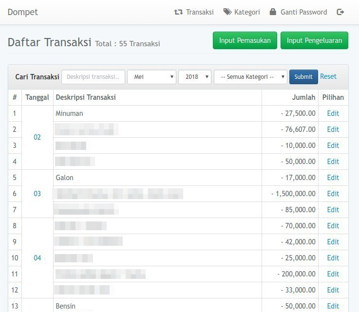
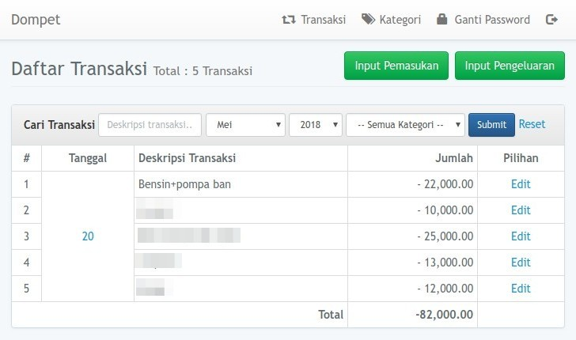

# Dompet

Dompet is a personal bookkeeping web application, built with Laravel 5.

## Objective
Easy bookkeeping for personal income and spending (amount of money).

## Concept

To aquire our objective, we need this features on the application:

- User can register.
- User can see transaction history by date.
- User add transactions for income and spending.
- User can categorize the transaction.
- User can see transaction summary on each month or a year.
- `-` sign on numbers indicates **spending/outcome** transaction.

Those are basic concept of the personal bookkeeping service.

## Getting Started
This application can be installed on local server and online server with these specifications :

#### Server Requirements
1. PHP 7.0 (and meet [Laravel 5.5 server requirements](https://laravel.com/docs/5.5#server-requirements)),
2. MySQL or MariaDB database,
3. SQlite (for automated testing).

#### Installation Steps

1. Clone the repo : `git clone https://github.com/nafiesl/dompet.git`
2. `$ cd dompet`
3. `$ composer install`
4. `$ cp .env.example .env`
5. `$ php artisan key:generate`
6. Create new MySQL database for this application
7. Set database credentials on `.env` file
8. `$ php artisan migrate`
9. `$ php artisan serve`
10. Register new account.

## Contributing

If you are considering to contribute to this repo. It is really nice.

1. Submit Issue if you found any errors or bugs or if you want to propose new feature.
2. Pull Request for bugfix, typo on labels, or new feature.
3. Pull Request for `en` lang files for English. Currently we only have `id` lang for Indonesian.

## Screenshots

#### Transaction List on a Month

#### Transaction List on Selected Date

## License

Dompet project is a free and open-sourced software under [MIT License](LICENSE).